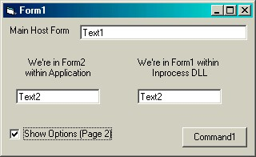



## Advanced Form Containers

### Description

The purpose of this demonstration application is to illustrate advanced techniques in using forms within the application or in an process (not remote) DLL to encapsulate functionality without effecting usability.

The key benefit of using an in-process DLL is in application distribution. If a change is made to only one part of the application contained in a DLL, then only the DLL needs to be distributed. Another benefit could include cross application useability.

An example of where this might be useful is if we have an inventory application and we want to view the suppliers on the same screen with the stock item or view all stock items on the suppliers screen. A common viewport is used to display associated information. If we are looking at the supplier screen, other information can be displayed in the common view port and could include outstanding orders, reports, historical data, etc. Each screen of data would be stored in their own forms.

The same information is displayed in both of the inventory application examples but requires no double coding as each form encapsulates the code for the interface and functionality/business-logic. For this to work, an interface class would be created and implemented into each form creating a common method of communicating.

A Form can be both a parent and child. The viewport on each parent form would be enabled or disabled depending if it was the parent or child form.

Vote for this project and Happy Coding...
 
### More Info
 

             |
---                |---
**Submitted On**   |2001-05-29 11:57:34
**By**             |[Slider](https://github.com/Planet-Source-Code/PSCIndex/blob/master/ByAuthor/slider.md)
**Level**          |Intermediate
**User Rating**    |4.7 (93 globes from 20 users)
**Compatibility**  |VB 6\.0
**Category**       |[Debugging and Error Handling](https://github.com/Planet-Source-Code/PSCIndex/blob/master/ByCategory/debugging-and-error-handling__1-26.md)
**World**          |[Visual Basic](https://github.com/Planet-Source-Code/PSCIndex/blob/master/ByWorld/visual-basic.md)
**Archive File**   |[Advanced F202025292001\.zip](https://github.com/Planet-Source-Code/slider-advanced-form-containers__1-23547/archive/master.zip)

